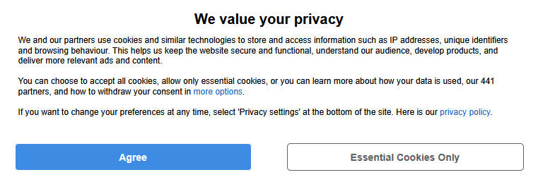

# PC Gamer Cookie Banner Fix

**pcgamer.com weaponises the cookie banner.**

Refuse, and it hounds you on every page until you break and accept
everything to make it vanish.

**NOT ANYMORE.** This filter takes the weapon away.
"Essentials only" not working? Now they have NONE.

## This is not a bug on your end

Before blaming your browser, here is what is actually happening. All of
this was verified in Firefox DevTools:

- Local Storage under `https://www.pcgamer.com` contains a valid
  `euconsent` string and a TCF `tcString` with `"gdprApplies":true`.
  **Your rejection is stored correctly.**
- The `/wrapper/v2/messages` request sends
  `"hasConsentData":true, "consentedToAll":false`.
  **They read your answer back before deciding to ask again. They knew.**
- The server returns a consent message anyway, and the banner renders
  again.
- Every `cdn.privacy-mgmt.com` request returns HTTP 200. Nothing is
  blocked, broken or expiring on the client.

Your consent persists. Their site reads it. It re-prompts you anyway.
The decision to keep asking is made on their server, with full
knowledge that you already answered.

Clearing cookies won't help. Changing Enhanced Tracking Protection
won't help. There is nothing on your machine to fix.

## Why they do it

Accepting is remembered forever. Refusing is remembered until your next
click. That asymmetry is the entire mechanism.

The banner is not there to ask you anything — it is there to make
refusing more expensive than agreeing. Every re-prompt is a bet that
you'll get tired before they do. And when you finally cave, they file
it as your free and informed consent.

Under GDPR, refusing is supposed to be as easy as agreeing.

The CMP is Sourcepoint and the publisher is **Future plc**. The same
setup runs across their properties, so if techradar.com,
gamesradar.com or tomshardware.com behave the same way for you, it's
the same cause.

## Why uBlock's built-in lists don't fix it

uBlock Origin's Cookie Notices lists try to click the reject button for
you, via `trusted-click-element`. On this CMP those scriptlets time out:
